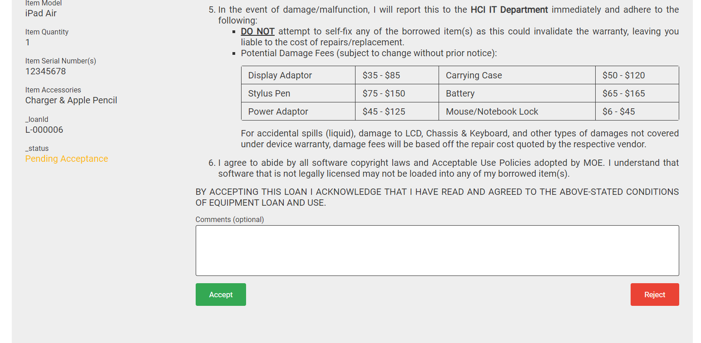

# Overview
The HC College IT Temporary Loan Apps Script is a container-bound script that creates a linked Google Sheets document as its “backend” database to the Google Form it is bound to. Additionally, the script needs to be deployed as a web application that functions as an endpoint for both borrowers and issuers. 

From here on, all references to the “database” refer to the Google Sheets document linked to the Google Form the script is bound to. 

# Initialisation
1. Create a versioned Web App deployment (refer to instructions by Google [here](https://developers.google.com/apps-script/concepts/deployments#create_a_versioned_deployment))
2. In the script’s App.gs file, line 44, paste the deployment URL into the `this.url` string

3. Start loaning equipment and filling in the form (see the [Flow](#flow) section below)!

# Flow

## Equipment Loan Out
1. HCI IT Staff fills out the Google form with details of the loan

2. The borrower will receive an email to with a link to acknowledge the loan (the borrower will only be able to access the page when logged in with his/her HCI Gmail account)

3. Upon borrower acknowledgement, the issuer will receive an email as a receipt

## Equipment Return
1. Upon confirmation that all equipment has been returned in good condition, relevant HCI IT staff visits the website URL mentioned in step 2 of [Initialisation](#initialisation) to search for the loans by the borrower’s email: 

2. Returning the loan is then as easy as clicking on the “Return” button on the desired loan

# References
This project was adapted from the [GAS-070 project](https://www.youtube.com/watch?v=PtIo_oPoAtk&t=496s) by Ashton Fei (YouTube). 

# Further Documentation
For further documentation about this project's design, see [documentation.md](./documentation.md). 