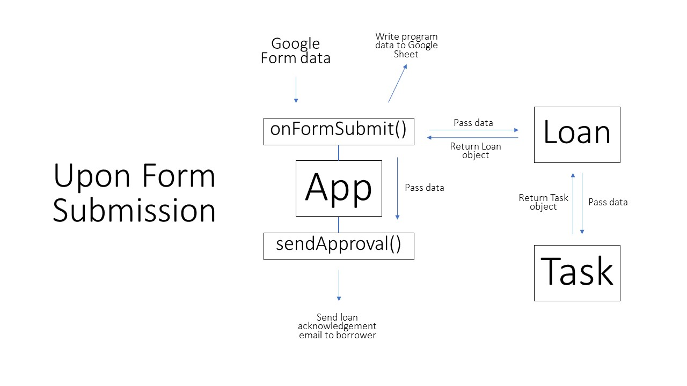
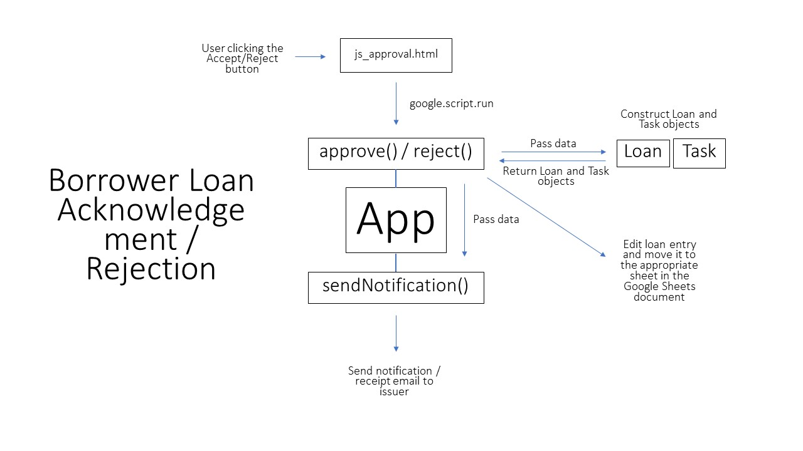
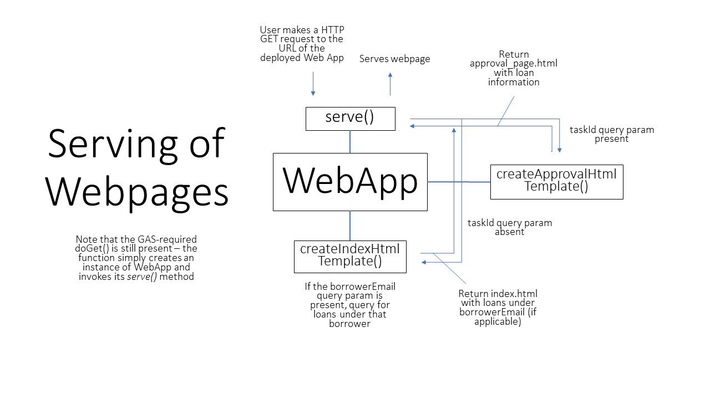
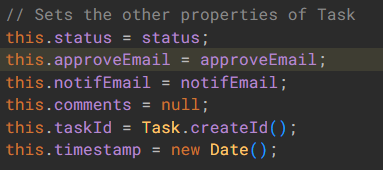
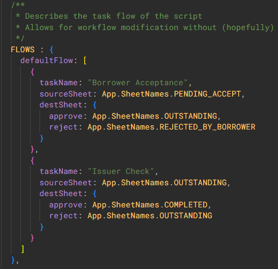

# Introduction
This document provides a description of the design of the HCI IT Temporary Loan Form project implemented with Google Apps Script. 

# Overall Design
The main classes are **App** and **WebApp**, which can be found in *App.gs* and *WebApp.gs* respectively. They handle the high-level operations of the service and web application respectively, and allow for the declaration of fewer global variables – the relevant class simply needs to be instantiated when the need (e.g. when the borrower is acknowledging the loan) arises. Enums are also used within all classes in the script to make changes to string literals easier, and this allows for better categorisation of literal data. 

There are two primarily data-wrapper classes in the script – **Task** and **Loan**, which can be found in *Task.gs* and *Loan.gs* respectively. An instance of Loan contains all the information about a loan (including one or more tasks), while a task is a step in the loaning process that involves sending emails and/or interacting with the web endpoint. These classes help to wrap and transfer data in a semantically sound and organised manner. 

The following diagrams illustrate some of the relationships (not exhaustive) between the **App**, **WebApp**, **Task** and **Loan** classes for various processes: 







For more information about each class/method/function, do read the comments preceding each code block. 

## App class

As the class in charge of overall script functionality, the **App** class makes use of the data-wrapper **Task** and **Loan** classes to manage queries on the database of loans in the linked Google Sheets document, as well as to update it with the *onFormSubmit()*, *approve()*, *reject()* and *returnLoan()* methods. The sending of emails to both the borrower and issuer is also managed by this class. 

Refactorings to this class include the modularisation of the *onFormSubmit()*, *approve()*, *reject()* and *returnLoan()* methods, as well as combining *approve()* and *reject()*. 

## WebApp class

The **WebApp class** in *WebApp.gs* manages the high-level functions of the web service associated with the script – it controls the conditions to serve the *index.html* and *approval_page.html* (and *404.html*) pages, mandates Google account login and manages authentication to prevent unauthorized activity. 

Crucially, the presence of query parameter *taskId* in the URL request differentiates serving *index.html* and *approval_page*.html, the latter page using the value of *taskId* to determine the loan being acknowledged by the borrower. In similar fashion, the user’s search bar input on *index.html* is passed back to the script as the *borrowerEmail* query parameter so that the appropriate query for loans under *borrowerEmail* is made. See below for an illustration: 

```js
// Serves index.html without search results
https://somescripturlhere/exec

// Serves approval_page.html for loan tied to task T-0000011
https://somescripturlhere/exec?taskId=T-0000011

// Serves index.html with loans under tants@hci.edu.sg
https://somescripturlhere/exec?borrowerEmail=tants@hci.edu.sg
```

### Javascript calls to server-side script
Aside from interactivity, with *google.script.run*, JS can be used to asynchronously call functions in the script, and handled with the appropriate success and failure handlers when returned/failed. This occurs whenever the borrower acknowledges or rejects the loan on *approval_page.html*, and whenever issuers return loans, using scripts in *js_approval.html* and *js_index.html* respectively. 

For more information regarding *google.script.run*, refer to GAS documentation on the topic [here](https://developers.google.com/apps-script/guides/html/reference/run). 


## Loan Class
The **Loan** class constructs objects which contain important information about each loan as their properties, and manages loan ID creation. Crucially, the instance can be constructed from either a loan’s *loanId*, or a *loanRecord*, which is a one-dimensional array of data representing the loan, and the sheetName of the sheet within which the loan resides. 

Each loan instance also contains task instances which contain information about tasks that need to be completed as steps in the loan and return process. 

### Loan Record
The loan record is a one-dimensional array (i.e. a row) of display values directly lifted from the database, of which all the data not of programming significance is grouped as an array of label-value objects named *loanDetails*. 


## Task Class
Similar to the **Loan** class, the **Task** class constructs objects containing the information about each task as their properties, and manages task ID creation. Common properties of all instances of Task include *status*, *approveEmail*, *notifEmail*, *comments* and *timestamp*. 



### *FLOWS* object
Each task object gets its additional information from a step in a particular flow in the global object *FLOWS*, which allows for the definition of different flows for different processes (thereby enabling greater scalability and customisability). In this script, for the purposes of HCI IT Temporary Loans, only one flow is defined, which termed *defaultFlow*. 



